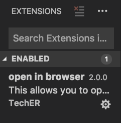

# Day 1 Exercises and References: HTML

### Configure VSCode

You should already have VSCode (Visual Studio Code) on your computer, as
this was part of the Internet Fundamentals course:
www.internetfundamentals.com

To this, we will add an extension.

1\. Open VSCode. On the left side of the window, click on the very last
icon:


2\. In the Search box, type in **Open in Browser** and hit return. You
should see a list of a bunch of extensions called Open in Browser.

3\. The very first one, or one near the top of the list, should be the
version from TechER. Click the green Install button.


Once installed, this will change to a blue Reload button. Click that,
and the extension will be installed.


The extension is installed when your screen looks like this:



###

### Together in class

Jen will discuss HTML terminology and introduce new tags, coding with
you in VBCode.

- HTML

- Tag

- Browser display of HTML

- \<!DOCTYPE\>

- Head and body

- Element

- Attribute

### Paragraph

`<p></p>`

```html
<p>This is a paragraph of information.</p>
```

https://developer.mozilla.org/en-US/docs/Web/HTML/Element/p

### Headings

`<h1></h1>`
`<h2></h2>`
`<h3></h3>`
`<h4></h4>`
`<h5></h5>`
`<h6></h6>`

```html
<h1>My Fine Website</h1>

<h2>An Article Title</h2>

<h3>A Subhead Within the Article</h3>
```

https://developer.mozilla.org/en-US/docs/Web/HTML/Element/Heading_Elements

### Unordered list (often called a "bullet list" - but remember, there's no formatting in HTML!)

`<ul></ul>`

Unordered list (often called a "bullet list" - but remember, there's no formatting in HTML!)

Used for lists where the items have no critical order of execution

_Always_ contains `<li>` tags!

https://developer.mozilla.org/en-US/docs/Web/HTML/Element/ul

```html
<ul>
   <li>Something</li>
   <li>Another thing</li>
   <li>Also this one</li>
</ul>
```

Used to identify headings within content on the page

https://developer.mozilla.org/en-US/docs/Web/HTML/Element/Heading_Elements

> While \<em\> is used to change the meaning of a sentence as spoken
> emphasis does (\"I *love* carrots\" vs. \"I
> love *carrots*\"), \<strong\> is used to give portions of a sentence
> added importance (e.g., \"**Warning!** This is **very dangerous.**\")
> Both \<strong\> and \<em\> can be nested to increase the relative
> degree of importance or stress emphasis, respectively.

https://developer.mozilla.org/en-US/docs/Web/HTML/Element/strong

## References

**HTML Elements Reference**

https://developer.mozilla.org/en-US/docs/Web/HTML/Element

**InternetingIsHard.com**

- Introduction
  https://internetingishard.com/html-and-css/introduction/

- Basic Web Pages
  https://internetingishard.com/html-and-css/basic-web-pages/

- Links and Images
  https://internetingishard.com/html-and-css/links-and-images/

- Semantic HTML
  https://internetingishard.com/html-and-css/semantic-html/

**Validating HTML**

http://validator.w3.org/

## Exercises

### Mark up a book chapter

Open the file \"book excerpt.txt\". This is the first chapter of a book
published in 1922 and which is now out of copyright.

Reformat this document in HTML, marking up anything you think relevant,
based on the tags you learned earlier today. Note that in some places,
I\'ve called for emphasis, while there\'s a link in another place.

## Additional HTML practice

If you finish early, and/or you want some more practice, work through
the following sections of exercises at W3Schools:

https://www.w3schools.com/html/exercise.asp

- HTML Attributes exercises 2-5

- HTML Headings, all exercises

- HTML Paragraphs, exercises 1-3

- HTML Comments, all exercises

- HTML Links, exercises 1-3, 5

- HTML Images, exercises 1, 3, 5, 6

- HTML Lists, exercises 1-2

### On Your Own

Once you\'ve finished the above work, start creating an \"about\" page
that\'s all about you. In this page, include the following:

- A paragraph of information about who you are, where you live, and
  what you currently do for work

- Another paragraph describing what you\'d like to do in web design
  and development

- Make a list of three important things to know about you

- Include a favorite quote, with citation for the person who said it

- Include at least one picture of yourself

- Link to a website that you like to visit frequently

If you still need more to do, make a page about some of your hobbies and
activities. Include:

- What is this hobby exactly?

- How does it make you feel?

- Where have you traveled because of your hobby? What other life
  experiences has your hobby provided, that you might not otherwise
  experience?

- Photos and/or videos of your hobby in action

- Links to websites describing your hobby, or where hobbyists discuss
  what they do

If you manage to get as far as creating both web pages, link them
together with a navigation bar.

As always, do not be concerned with how these pages look. They are Ugly
Web Pages^TM^! Be sure to use the right HTML tags to communicate what
the content is about, not what you think is pretty.

We will start to make this pretty tomorrow, I promise!
